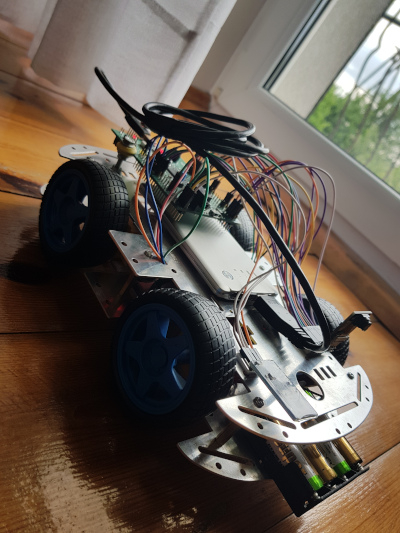

# 4-kołowy pojazd sterowany za pomocą bluetooth

## Wykorzystane części

* Mikrokontroler STM32F407VGTx
* [Kamera cyfrowa OV9655](https://botland.com.pl/pl/kamery-do-arduino-i-raspberry-pi/4939-modul-kamery-ov9655-13mpx-03mpx-1280x1024px-30fps-waveshare-6150.html)
* [Moduł bluetooth HC-05 v2](https://botland.com.pl/pl/moduly-bluetooth/2891-modul-bluetooth-hc-05-v2.html)
* [Metalowe podwozie robota 4WD](https://botland.com.pl/pl/podwozia-robotow/9300-metalowe-podwozie-robota-4wd-czterokolowe-z-silnikami-prostokatne.html)

* Zasilanie:
  * powerbank USB
  * 4 ogniwa AA

## Wykorzystane narzędzia

* STM32CubeMX
* [MIT App Inventor](https://appinventor.mit.edu) - środowisko do tworzenia aplikacji mobilnych

## Wykorzystane biblioteki

*

## Sterowanie pojazdem

Pojazd jest kontrolowany przez aplikację działającą na telefonach z systemem
Android. Do komunikacji z pojazdem używany jest Bluetooth.

## Autorzy

[Tomasz Michalik](https://github.com/Binkol)

[Tobiasz Komarnicki](https://github.com/mooosq)

[Hubert Piechota](https://github.com/m3tav3rse)
